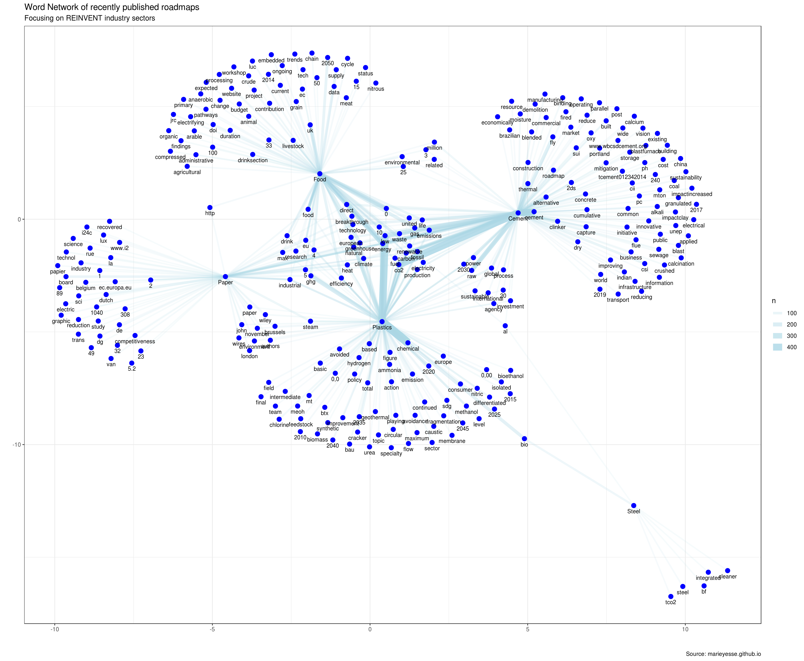

During the [REINVENT](http://www.reinvent-project.eu) project various studies have been done, looking either at broader transition narratives and specific innovations. On this page I zoom out of the material for a bit, to provide an overview of all the things that have been looked at.

## REINVENT as EU project

[REINVENT](http://www.reinvent-project.eu) is a European Union funded research project. It's part of the H2020 Environment and Resources programme, which is a relative small one compared to some other EU funded programmes. Of the 6737 projects listed in the [EASME DB](https://sc5.easme-web.eu/), only 379 have some connection to the [REINVENT](http://www.reinvent-project.eu) themes (basic manufacturing, transitions, industry). Interestingly from my analysis of the [EASME DB](https://sc5.easme-web.eu/), the majority of the projects with an manufacturing industry connection are dedicated to food related themes. Second runner up is the chemical/plastics theme. Of these, it are mostly SME's who get projects funded (via the EIT SME fund),  although most euro's go to assumingly Engineering/R&D projects in the H2020 Advanced Materials Manufacturing Processing and Biotechnology. 


 

**Figure:** Overview of funded research projects (numbers and funding)


## Roadmaps and scenario studies
In our first [deliverable (D4.1)](https://static1.squarespace.com/static/59f0cb986957da5faf64971e/t/5a968cd7652deaeda0a2a62a/1519815901936/D4.1+Existing+visions+and+scenarios.pdf) we took stock of the available forward looking literature on industry decarbonization. I have also quickly scraped together some of the data processing work that I had done for this report [(see the other github page here)](https://marieyesse.github.io/IAM_dashboard.html). We have been so busy with scraping the docs that it never came to me to take a step back and look at it from a more meta perspective. Well. Here we are now! In belows figures I categorize the analysed corpus to (1) industry and (2) field of publishing. The timeline is also supplemented with new publications released after completing our deliverable (>2016)

```{r roadmaps, results=TRUE, message=FALSE, warning=FALSE, echo=FALSE, fig.align="center", fig.width=11, fig.height=9, fig.cap="_**Figure**: Timeline of published roadmaps and scenario studies on industry decarbonization per industry"}


## Required packages
### If not yet availabe, use install.packages("")

# Soc Media API readers
library(rtweet)

#install.packages("readxl")
library("readxl")

# plotting and pipes!
library(ggplot2) 
library(ggforce)
library(plotly)
library(patchwork)
library(dplyr)
library(tidyr) 
library(data.table)
library(paletteer) 
library(ggrepel)
library(igraph)
library(ggraph)
library(ggforce)

# text mining library
library(tidytext)
library(tm)   
library(stringr)
library(tabulizer)

# coupled words analysis
library(widyr)

#install.packages("readxl")
library("readxl")

######## Timeline plotting

ROADMAPSdat = read.csv("data/REINVENT_meta.csv", sep=",", dec=".")

TIMELINEpretty_Focus = ROADMAPSdat  %>%
  group_by(Year.of.publication) %>%
  arrange(Focus) %>% 
  mutate(text_position=row_number(),
         #odd and even numbers
         location=ifelse(Year.of.publication %% 2, -1, 1)) %>%
  mutate(text_y=(((count+(text_position*0.6))*location))+location) %>%
  
  ggplot() +
  geom_hline(yintercept = 0, colour="black")+
  geom_hline(yintercept = 0, colour="black")+
  
  # Grey line & point
  geom_segment(aes(x=Year.of.publication, xend=Year.of.publication, yend=location*2), y=0, colour="grey80") +
  geom_point(aes(x=Year.of.publication), y=0, size=3) +
  
  # Timeline text
  geom_text(aes(x=Year.of.publication, y=(location*0.7), label=Year.of.publication), hjust=0.5, size=4, fontface="bold") +
  
  # fixed points
  # geom_text(aes(x=2000, y=0.7, label=2000), hjust=0.5, size=4, fontface="bold") +
  # geom_text(aes(x=2019, y=-0.7, label=2019), hjust=0.5, size=4, fontface="bold") +
  # geom_point(aes(x=2000), y=0, size=3) +
  # geom_point(aes(x=2019), y=0, size=3) +
  
  # Lists of publications
  geom_text( aes(x=Year.of.publication, y=text_y, label=substr(Prepared.by, 1, 10), colour=Focus), hjust=0.5, size=3, fontface="bold") +
  
  
  #coord_cartesian(ylim=c(-30:30)) +
  guides(colour=guide_legend( "Industry", override.aes = list(size = 5)))+
  theme_void() +
  scale_colour_paletteer_d(ggthemes, wsj_colors6) +
  theme(
   plot.title=element_text(size=16, hjust=0.5, face="bold"),
   plot.subtitle=element_text(size=14,hjust=0.5),
   legend.key =  element_rect(fill = 'white', size = 2),
   legend.text=element_text(size=13),
   legend.title=element_text(size=15, face="bold"),
   
   strip.background = element_rect(colour="white", fill="#FFFFFF")
  ) +
  labs(title = "Scenario and Roadmap studies over time",
       subtitle = "Filtered on REINVENT sectors ",
       y = "Number of publications", x = "Sector", caption = "\n Source: marieyesse.github.io") 


print(TIMELINEpretty_Focus)
```

Of course there can be some bias in the selection and I have not been super strict in my "hauls" of new literature either (not all are model-based scenarios for example, not all are EU-focused, not all are looking at a 2050 objective, etc). Nonetheless, the overview remains interesting.

```{r roadmaps_field, results=TRUE, message=FALSE, warning=FALSE, echo=FALSE, fig.align="center", fig.width=12, fig.height=9, fig.cap="_**Figure**: Timeline of published roadmaps and scenario studies on industry decarbonization per pusblishing field"}

ROADMAPSdat = read.csv("data/REINVENT_meta.csv", sep=",", dec=".")
## Per Field


TIMELINEpretty_Field = ROADMAPSdat  %>%
  group_by(Year.of.publication) %>%
  arrange(Field) %>% 
  mutate(text_position=row_number(),
         #odd and even numbers (%%)
         location=ifelse(Year.of.publication %% 2, -1, 1)) %>%
  mutate(text_y=(((count+(text_position*0.6))*location))+location) %>%
  
  ggplot() +
  geom_hline(yintercept = 0, colour="black")+
  geom_hline(yintercept = 0, colour="black")+
  
  # Grey line & point
  geom_segment(aes(x=Year.of.publication, xend=Year.of.publication, yend=location*2), y=0, colour="grey80") +
  geom_point(aes(x=Year.of.publication), y=0, size=3) +
  
  # Timeline text
  geom_text(aes(x=Year.of.publication, y=(location*0.7), label=Year.of.publication), hjust=0.5, size=4, fontface="bold") +
  
  # fixed points
  # geom_text(aes(x=2000, y=0.7, label=2000), hjust=0.5, size=4, fontface="bold") +
  # geom_text(aes(x=2019, y=-0.7, label=2019), hjust=0.5, size=4, fontface="bold") +
  # geom_point(aes(x=2000), y=0, size=3) +
  # geom_point(aes(x=2019), y=0, size=3) +
  
  # Lists of publications
  geom_text( aes(x=Year.of.publication, y=text_y, label=substr(Prepared.by, 1, 10), colour=Field), hjust=0.5, size=3, fontface="bold") +
  
  
  #coord_cartesian(ylim=c(-30:30)) +
  guides(colour=guide_legend( "Field", override.aes = list(size = 5)))+
  theme_void() +
  scale_colour_paletteer_d(ggthemes, wsj_colors6) +
  theme(
    plot.title=element_text(size=16, hjust=0.5, face="bold"),
    plot.subtitle=element_text(size=14,hjust=0.5),
    legend.key =  element_rect(fill = 'white', size = 2),
    legend.text=element_text(size=13),
    legend.title=element_text(size=15, face="bold"),
    
    strip.background = element_rect(colour="white", fill="#FFFFFF")
  ) +
  labs(title = "Scenario and Roadmap studies over time",
       subtitle = "Filtered on publishing field ",
       y = "Number of publications", x = "Sector", caption = "\n Source: marieyesse.github.io") 


print(TIMELINEpretty_Field)
```

Analysing the meta-data of studies, it's the first step up towards full qualitative Corpus analysis. I learned that extracting all text of all multi-k worded reports is pushing my system to its limits, so I am just going to put the image to the outcome of my word network analysis here. One take-away here is that most sectors appear to apply their own language in most cases - with only a few overlapping semantics (limited to europe, technology, carbon, emissions, etc). Surprising? No, perhaps not, but interesting nonetheless. 

 

*(If it's too small to read, you might want to right click > view image)*


## Innovations studied

The REINVENT project also looked at various social and technological innovations from a more social science perspective. The dataset is quite extensive and I found myself rather overwhelmed by all the information coming at me that was not easily structured.  As I needed a practice dataset for a new R skill, I fiddled around with this dataset to create the following overview. What I figured out by doing so is that our Innovations database had quite a large portion of technology-oriented innovations. Surprised? No, perhaps not, but I somehow expected a bigger focus on social innovations! (which seems only the case in the Meat/Dairy sector)

<blockquote class="twitter-tweet" data-lang="nl"><p lang="en" dir="ltr">🆙Curious about which <a href="https://twitter.com/hashtag/lowcarbon?src=hash&amp;ref_src=twsrc%5Etfw">#lowcarbon</a> <a href="https://twitter.com/hashtag/innovations?src=hash&amp;ref_src=twsrc%5Etfw">#innovations</a> have been studied in the <a href="https://twitter.com/REINVENT_EU?ref_src=twsrc%5Etfw">@REINVENT_EU</a> <a href="https://twitter.com/hashtag/industry?src=hash&amp;ref_src=twsrc%5Etfw">#industry</a> <a href="https://twitter.com/hashtag/sectors?src=hash&amp;ref_src=twsrc%5Etfw">#sectors</a>? I used the <a href="https://twitter.com/REINVENT_EU?ref_src=twsrc%5Etfw">@REINVENT_EU</a> innovations database (<a href="https://t.co/WLpVCbC7ay">https://t.co/WLpVCbC7ay</a>) as a test case for further live <a href="https://twitter.com/hashtag/data?src=hash&amp;ref_src=twsrc%5Etfw">#data</a> exploration: <a href="https://t.co/l1RwCiBoYm">https://t.co/l1RwCiBoYm</a></p>&mdash; Mariësse van Sluisveld (@marieyesse) <a href="https://twitter.com/marieyesse/status/1105027480086347777?ref_src=twsrc%5Etfw">11 maart 2019</a></blockquote>
<script async src="https://platform.twitter.com/widgets.js" charset="utf-8"></script>
